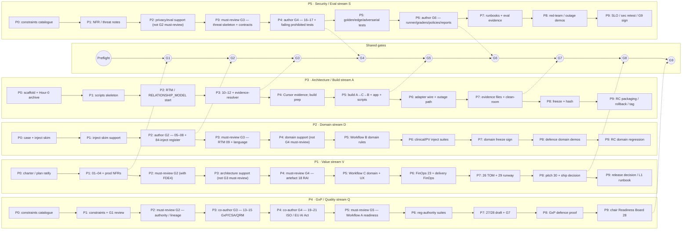
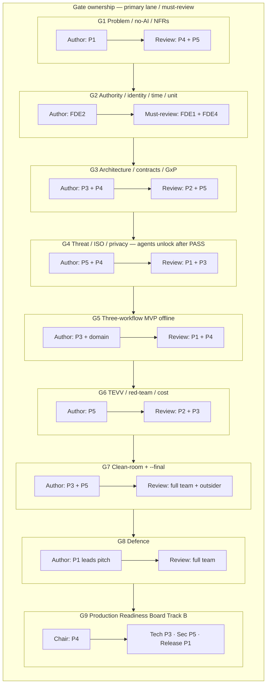
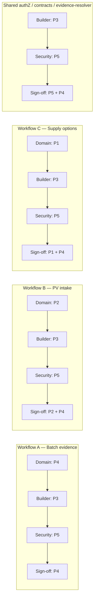
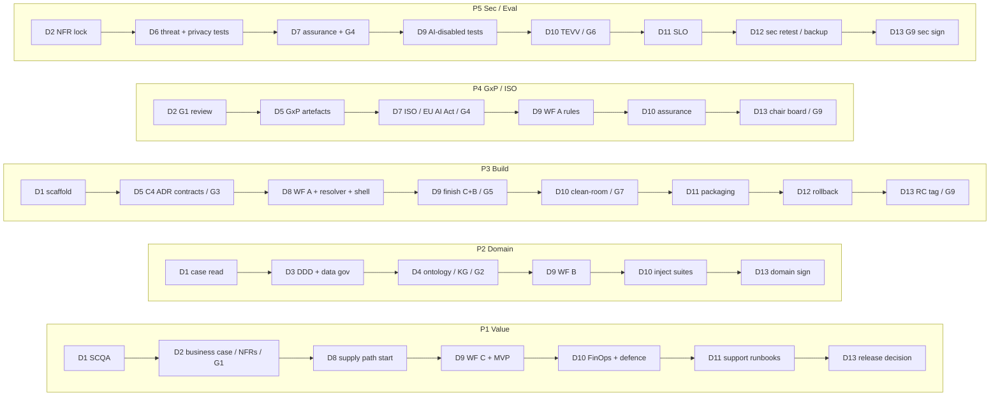

# Project AEGIS-PHARMA — Delivery Swimlanes (V2)

> Derived from `AEGIS_PROJECT_PLAN_V2.md` §§5–8, §6.5 parallel streams, Option B+ calendar.  
> **Classification:** Synthetic training only — not for real GxP / clinical / PV / supply / recall decisions.

| Field | Entry |
|---|---|
| Title | Track A / Track B swimlanes by seat (P1–P5) |
| Source of truth | `AEGIS_PROJECT_PLAN_V2.md` |
| Version / date | **V2.0** — 2026-08-05 |
| Status | Companion visual to governing plan |
| Excel tracker | `AEGIS_PROJECT_SWIMLANE_TRACKER_V2.xlsx` — phase/day matrices (phases & days as rows; seats FDE1–FDE5 as columns) + task rows (regenerate/validate via `_build_swimlane_tracker_v2.py`) |

**How to read:** each horizontal lane is a seat/stream. Time runs left → right (phases P0–P9 / gates G1–G9). Boxes are that seat’s parallel focus from the plan; diamonds are shared gates.

---

## 1. Seat lanes × phases (Track A + optional P9)

**Agent freeze (plan DECISION):** no agent / model-inference feature coding until **G4 PASS**. Deterministic core always on.

**Build order inside P5 (plan DECISION G-24):** shared evidence-resolver → Workflow **A** → **C** → **B**.

---

## 2. Compact RACI swimlane (who owns what at each gate)

---

## 3. Workflow RACI swimlane

**Forbidden on all lanes:** release/reject/reprocess/relabel/recall · final PV seriousness/causality/expectedness/reportability/signal confirm · reserve/allocate/ship/quality-status change. All responses keep `execution_status: "not_executed"`.

---

## 4. Option B+ day swimlanes (D1–D14)

Recommended ~4h sessions from plan §5.4. Lanes show primary owner; others support.

| Day | Focus | Gate |
|---|---|---|
| D1 | Preflight + SCQA start | — |
| D2 | Business case, stakeholders, blueprint, prod NFRs | G1 |
| D3 | DDD + data gov + brownfield | — |
| D4 | Ontology + KG + inject map | G2 |
| D5 | C4 + ADR + contracts + GxP | G3 |
| D6 | Threat modelling + privacy + security tests | — |
| D7 | ISO 42001 + EU AI Act + assurance + human factors | G4 |
| D8 | Build WF A (+ resolver) + app shell; start C | — |
| D9 | Finish C + B; AI-disabled; MVP demo | G5 |
| D10 | TEVV / FinOps / clean-room / defence | G6–G8 |
| D11 | P9: SLO, runbooks, packaging | — |
| D12 | P9: security retest, backup/restore, rollback | — |
| D13 | Production Readiness Board + RC tag | G9 |
| D14 | Buffer / defect burn-down (optional) | — |

---

## 5. Phase hour map (Track A)

| Phase | Hours | Exit gate | Parallel focus (plan §8) |
|---|---:|---|---|
| P0 Preflight | 0–2 | Preflight | All: baseline PASS; ratify plan |
| P1 Discovery | 2–7 | G1 | P1: 01–04; P2 inject skim; P3 scripts; P4/P5 constraints |
| P2 Domain | 7–12 | G2 | P2: 05–08 + inject register; P3 RTM; P4 authority |
| P3 Architecture | 12–18 | G3 | P3: 10–12 + resolver; P4: 13–15; P5 threat + contracts |
| P4 Secure design | 18–23 | G4 | P5: 16–17 + failing tests; P4: 19–21; P1: 18 |
| P5 POC build | 23–31 | G5 @26 | P3 A→C→B + app; domain rules; P5 tests; AI-disabled |
| P6 TEVV | 31–35 | G6 @34 | P5 eval stack; P1 FinOps; red-team/outage |
| P7 Ops | 35–38 | G7 @38 | Runbooks; evidence; clean-room; 26–29 |
| P8 Defence | 38–40 | G8 | Pitch + 13 defence elements |
| P9 Hardening | +16–24 | G9 | Track B only — production-ready claim |

---

## 6. Owes by lane (defence / RC)

| Seat | By G8 | Extra by G9 |
|---|---|---|
| P1 | 01–04, 26, 29, 30; WF C | Release decision; L1 runbook; G9 minutes |
| P2 | 05–08; inject map; WF B | RC domain regression sign-off |
| P3 | 09–12; app/src/scripts; clean-room | RC tag, packaging, rollback, manifest |
| P4 | 13–15, 19–21; WF A; GxP proof | Chair 28 board; residual risk sign |
| P5 | 16–18, 22–25, 27; security tests | SLO/observability; RC retest; G9 sec sign |

---

## Traceability

| Diagram | Plan anchors |
|---|---|
| §1 phase swimlanes | §§6.1, 6.5, 8 |
| §2 gate RACI | §8.2 checkpoint questions |
| §3 workflow RACI | §6.4 |
| §4 Option B+ days | §5.4 |
| §5 hour map | §5.2, §9 |
| §6 owes | §17 |
